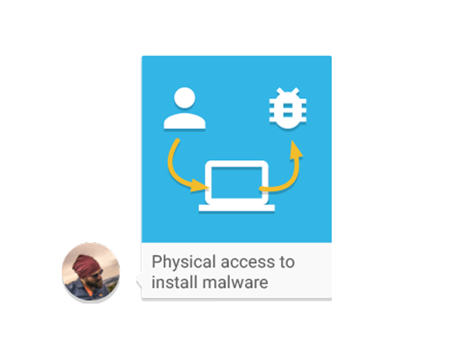

# How can attackers use malware to target me?

The most common method of attack is to trick you into installing the malware yourself. There are many ways they try to do this.  

*   They may disguise the malware as a link to a website, a document, a software update, or even a program designed to help secure your computer.
*   You may be targeted via email (which may look as if it's coming from someone you know), via a message on Skype or Twitter, or even via a link posted to your Facebook page.
*   You can also infect your computer by connecting infected hardware, like a USB key given to you or found near your office, or a phone connected to charge.

The more targeted the attack the more they'll try to make it look like something you want to open. For example, in Syria, pro-Assad hackers targeted members of the opposition with malware hidden in fake revolutionary documents and a fake anti-hacking tool. And in Morocco, activists were targeted with malware hidden in a document made to look as if it had been sent by an Al-Jazeera reporter, promising information about a political scandal.

There is also the possibility of someone gaining physical access to your computer to install malware themselves.